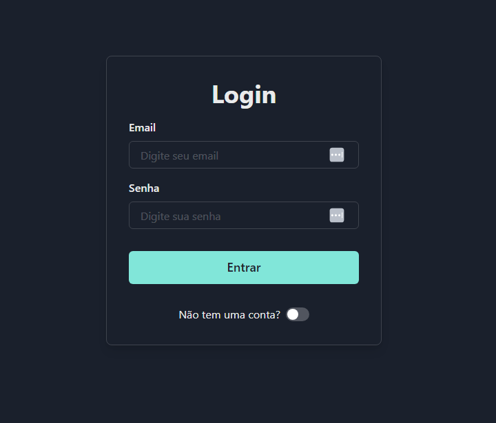

# DF Ignição Digital

## Funcionalidades

### Login
- Autenticação de usuário com JWT.

### Gerenciamento de Clientes Completo
- **Adição de Clientes:** Adicione novos clientes com facilidade.
- **Organização com Tags:** Associe tags relevantes para melhor organização.
- **Visualização de Clientes:** Visualize a lista completa de clientes e suas tags.
- **Atualização de Dados:** Atualize os dados dos clientes com praticidade.
- **Exclusão de Clientes:** Exclua clientes da base de dados quando necessário.
- **Interface Intuitiva:** O design amigável facilita o uso das funcionalidades da aplicação.

## Pré-requisitos

- **Docker:** Necessário para construir e iniciar os containers.

### Passos para Inicialização
1. Execute o comando `docker-compose up` para construir e iniciar os containers.
2. Acesse a aplicação nos seguintes endereços:
   - **Frontend:** [http://localhost:3000](http://localhost:3000)
   - **Backend:** [http://localhost:4000](http://localhost:4000)
   - **Documentação Backend:** [http://localhost:4000/docs](http://localhost:4000/docs)
   - **Documentação Frontend:** Consulte o README específico na pasta correspondente clicando (aqui)link_.
   - **Documentação Frontend** Consulte o README específico na pata corresponsente clicando aqui()_.


  ### Comandos Docker Adicionais

- **Construir os Containers sem Cache:**

```bash
  docker-compose build --no-cache
```
- **Parar e Remover Containers em Execução:**
```bash
  docker-compose down
```
- **Remover Todos os Volumes Associados aos Containers:**
```bash
  docker-compose down -v
```
- **Executar Comando em um Container em Execução:**
```bash
    docker-compose exec -it <nome_do_servico> <comando>
```
- **Verificar Status dos Containers:**
```bash
  docker-compose ps
```

### Organização em Monorepo
- O projeto é estruturado em um único repositório, facilitando o gerenciamento e a integração das diferentes partes.

### Pastas Principais
- **backend:** Servidor da aplicação.
- **frontend:** Interface da aplicação.
- **backend/src/routes/:** Hospeda a documentação detalhada da aplicação.

## Melhorias Adicionais Pendentes
- [ ] Ao expirar o token redirecionar usuário para pagina de login
- [ ] Deverar ser possivel deletar categoria de tag das opções de tags a ser escolhidas.
- [ ] Concluir testes e2e em todos os endpointes
- [ ] criar togle para dark mode e light mode

#### Dark mode and Light mode:
- key local history
> `chakra-ui-color-mode`\
> value: light\
> value: dark

**Autenticação JWT:**
- Para login sem criar um usuário:
  - Email: `pedronava@gmail.com`
  - Senha: `123`
- Caso contrário, você pode criar um novo usuário para acessar e gerenciar os clientes.

> **Lembre-se:** Para mais detalhes sobre o frontend, consulte o README específico na pasta correspondente.

# Interface

## Login
<details>
<summary>Login light mode</summary>
<br>
ligh mode
<br><br>
</img>
</details>

---

<details open>
<summary>Login dark mode</summary>
<br>
Well, you asked for it!
<br><br>
</img>
</details>

---

## Registrar

---
<details>
<summary>Registrar light mode</summary>
<br>
ligh mode
<br><br>
</img>
</details>

---

<details>
<summary>Registrar dark mode</summary>
<br>
dark mode
<br><br>
</img>
</details>

---

## Gerenciamento

---

<details>
<summary>Gerenciamento de Tags dark mode</summary>
<br>
dark mode
<br><br>
</img>
</details>

---
<details open>
<summary>Gerenciamento de Tag light mode</summary>
<br>
light mode
<br><br>
</img>
</details>

---

<details>
<summary>Gerenciamento de novo usuário light mode</summary>
<br>
light mode
<br><br>
</img>
</details>

---

<details>
<summary>Gerenciamento de novo usuário dark mode</summary>
<br>
dark mode
<br><br>
</img>
</details>

---

<details>
<summary>Edição de usuário dark mode</summary>
<br>
dark mode
<br><br>
</img>
</details>

---


<details>
<summary>Edição de usuário light mode</summary>
<br>
light mode
<br><br>
</img>
</details>

---

<details>
<summary>Criação de nova tag dark mode</summary>
<br>
dark mode
<br><br>
</img>
</details>

---

<details>
<summary>Criação de nova tag light mode</summary>
<br>
light mode
<br><br>
</img>
</details>

---
